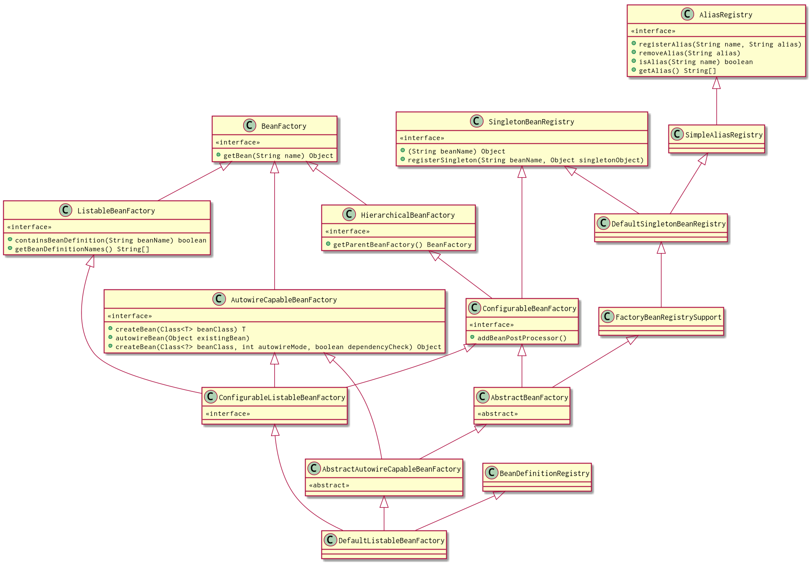

= SpringIOC

== 定义

ioc控制反转和DI依赖反转是一个意思。它是通过构造方法，工厂方法，或者通过构造方法或构造方法返回实例后设置属性来定义依赖的过程。容器在创建bean的时候注入他们的依赖，从根本上反转了bean自己初始化控制或者用类直接定义的构造来定位依赖或者服务定位机制（所以叫控制反转）。

== 结构

 上图为spring IOC 简化后的类图结构。如图所示，BeanFactory是spring IOC的基础。BeanFactory提供了高级机制可以管理任何类型的类。ApplicationContext 是BeanFactory的子接口。它添加了：

    . 轻松整合springAOP
    . 消息资源处理（用于国际化）
    . 活动发布
    . 应用层特殊的上下文，如WebApplicationContext用于web 应用。

== 例子
下面是一个最简单的springIOC 实现
[source,xml]
.beans.xml
----
<?xml version="1.0" encoding="UTF-8" ?>
<beans xmlns="http://www.springframework.org/schema/beans"
       xmlns:xsi="http://www.w3.org/2001/XMLSchema-instance"
       xsi:schemaLocation="http://www.springframework.org/schema/beans https://www.springframework.org/schema/beans/spring-beans.xsd">

    <bean name="hello" class="per.zsf.study.springframework.beanfactory.defaultListable.Bean">
    </bean>
</beans>
----

[source,java]
.DefaultListableBeanFactoryStudy.java
----
 DefaultListableBeanFactory beanFactory = new DefaultListableBeanFactory();
 XmlBeanDefinitionReader reader = new XmlBeanDefinitionReader(beanFactory);
 reader.loadBeanDefinitions("beans.xml");
 beanFactory.getBean("hello");
----

== 源码实现

由例子可以看出，springIOC整体粗率分为三步:

. 初始化容器
. 加载解析元数据
. 实例化 bean

接下来一步一步看。

=== 初始化ioc容器

这里的ioc容器是最基础的DefaultListableBeanFactory。

=== 加载解析元数据
这里使用的是XmlBeanDefinitionReader,来加载解析xml的元数据。

. 程序入口
----
AbstractBeanDefinitionReader 父类
    //多个文件地址，遍历调用
    loadBeanDefinitions(String... locations)
    //一个文件地址,已经解析的资源为null
    loadBeanDefinitions(String locations)
    //一个文件位置，已经解析的资源为actualResources。ResourceLoader 根据路径获取resource
    loadBeanDefinitions(String location, @Nullable Set<Resource> actualResources)
    //多个resource，遍历调用。
    loadBeanDefinitions(Resource... resources)
XmlBeanDefinitionReader 具体实现类
    loadBeanDefinitions(Resource resource) 具体实现。
----
可以看出无论哪个具体调用入口，最终都会都需要调用 `loadBeanDefinitions(Resource resource)`

2. XmlBeanDefinitionReader loadBeanDefinitions(Resource resource)分析

=== 实例化bean